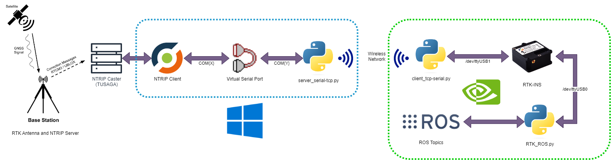

# RTK GPS Data System for Quadruped Robot

This project establishes a unique solution to provide RTK (Real-Time Kinematic) GPS data to a quadruped robot. Due to the absence of an NTRIP client compatible with the Jetson Nano's ARM64 architecture, a series of scripts were designed to bridge the data flow between a Windows-based NTRIP client and the actual RTK GPS module connected to the Jetson Nano.

## Additional ROS Packages

- https://docs.ros.org/en/jade/api/robot_localization/html/index.html

## Setup

Before you proceed, if you're using the server script to connect to a virtual serial port, you'll need tools to create such ports:

### Windows:
- **com0com**: A free and open-source tool that allows you to create virtual serial port pairs. [Download and installation guide](http://com0com.sourceforge.net/)

### Linux:
- **socat**: A versatile tool that establishes two bidirectional byte streams and transfers data between them. Install it using your package manager, for example:
```
sudo apt-get install socat
```
Then, to create a virtual serial port pair:
```
socat PTY,link=/tmp/virtualcom0 PTY,link=/tmp/virtualcom1
```

### macOS:
- **socat**: The same tool used in Linux is available for macOS. You can install it using Homebrew:
```
brew install socat
```
Then, create virtual serial port pairs similarly to the Linux method mentioned above.

## System Overview

The system consists of four main components:
1. **NTRIP Client on Windows**: This client fetches the RTK corrections and sends it to a virtual serial port.
2. **Server Script (server_serial-tcp.py)**: Running on the same Windows machine, this script reads data from the virtual serial port and forwards it over TCP.
3. **Client Script (client_tcp-serial.py)**: Running on the Jetson Nano, this script connects to the TCP server, receives RTK corrections, and writes them to a physical serial port connected to the GPS module.
4. **RTK ROS Node (RTK_ROS.py)**: This script reads the corrected GPS data and publishes it to a ROS topic for the robot's consumption.



## Why this approach?

Jetson Nano, with its ARM64 architecture, lacks a compatible NTRIP client. However, the robot's precise positioning necessitates RTK GPS data. This system bridges the data flow, allowing an NTRIP client on a different architecture (Windows machine with amd64) to fetch and forward corrections to the GPS module on the Jetson Nano.

## Usage Guide

### 1. NTRIP Client:
Set up your NTRIP client on your Windows machine to fetch RTK corrections. Configure the client to output the corrections to a virtual serial port (e.g., COM10).

### 2. Server Script (server_serial-tcp.py):

Run the script on your Windows machine to establish a TCP server:

```
python server_serial-tcp.py -s <virtual_serial_port> -b <baud_rate>
```

### 3. Client Script (client_tcp-serial.py):

Run the script on the Jetson Nano to connect to the TCP server:

```
python client_tcp-serial.py -i <server_ip> -s <physical_serial_port> -b <baud_rate>
```

### 4. RTK ROS Node (RTK_ROS.py):

After setting up the ROS environment on the Jetson Nano, run the script:

```
python RTK_ROS.py
```

This will start reading the corrected GPS data and publish it to a specified ROS topic.

## Dependencies
- Python (both on Windows machine and Jetson Nano)
- pyserial: Install using `pip install pyserial`
- ROS environment (on Jetson Nano)

## Notes

- Ensure correct port forwarding and firewall settings if accessing over the public internet.
- Ensure the virtual serial port tools are set up correctly (e.g., com0com for Windows, socat for Linux/macOS).
- Ensure you have adequate security measures in place for data communication.
