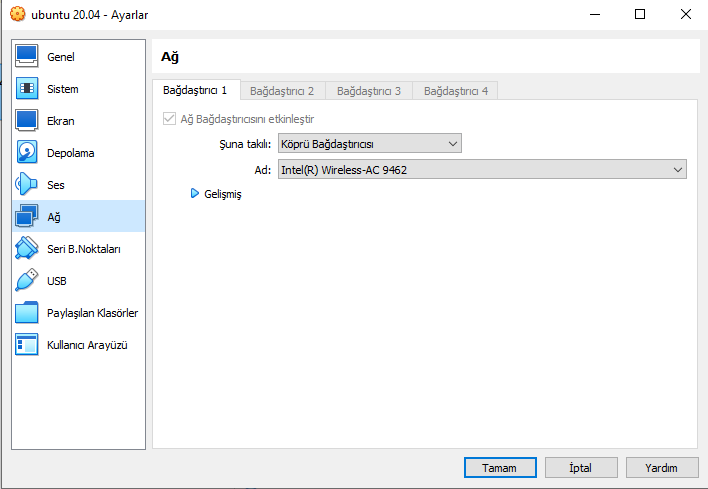

# ROS2 Unity VR Point Cloud Visualization

## Overview
This guide details the visualization of point cloud data from ROS1 Neotic in Unity VR. The visualization pipeline is divided into two main parts: setting up ROS to publish point cloud data, and setting up Unity to visualize this data in VR. Also there is comminication part. One PC is running on Ubuntu which get the point cloud data from sensors and publish using network other one on Virtual Box which is get the point cloud data using network and send the topic to Unity using websocket.

## Prerequisites:
- Virtual Box Ubuntu 20.04
- ROS1 Noetic
- `rosbridge_suite` for the WebSocket connection between ROS and Unity

### Installing `rosbridge_suite`:
To install `rosbridge_suite`, use the following command:

```bash
sudo apt-get install ros-<rosdistro>-rosbridge-server
```
## Part 1: ROS Communication Between Two Machine and ROS Configuration
### Virtual Box Settings:
If the topic is taken from another computer, I recomend to use Virtual Box on Windows. There is no VR support on Linux. Ros commuinication between two machine is happend only when each machine is in the same LAN Network and same subnet. You can check ip address using cmd
```bash
ipconfig
```
in Linux terminal
```bash
ifconfig
```
Virtual Box Network Settings should be changed to be in same subnet. Network Settings -> Attached to -> Bridge Adapter


## Ubuntu Terminal Settings for Virtual Box Machine
Virtual box machine should be run as a server machine. First check Virtual Box machine ip using ifconfig command. I assume this machine ip is 172.20.10.3 . Check other Ubuntu Machine ip address, I assume this machine ip is 172.20.10.4.
First terminal of Virtual Box Machine:
```bash
sudo ufw enable
sudo ufw allow from 172.20.10.4
sudo ufw allow to 172.20.10.4 
sudo ufw status
export ROS_MASTER_URI=http://export ROS_MASTER_URI=http://172.20.10.3:11311
export ROS_IP=172.20.10.3
roscore
```
Terminal of Ubuntu Machine:
```bash
sudo ufw enable
sudo ufw allow from 172.20.10.3 
sudo ufw allow to 172.20.10.3
sudo ufw status
export ROS_MASTER_URI=http://export ROS_MASTER_URI=http://172.20.10.3:11311
export ROS_IP=172.20.10.4
#if there is saved bag file
rosbag play file.bag
```
Second terminal of Virtual Box Machine:
```bash
export ROS_MASTER_URI=http://export ROS_MASTER_URI=http://172.20.10.3:11311
export ROS_IP=172.20.10.4
rostopic list #first check topics
rostopic echo /msg
```
Third terminal of Virtual Box Machine:
```bash
export ROS_MASTER_URI=http://export ROS_MASTER_URI=http://172.20.10.3:11311
export ROS_IP=172.20.10.4
#start websocet to connect ROS1 and Unity
roslaunch rosbridge_server rosbridge_websocket.launch
```

## Part 2: Unity Setup

### Scripts and Shaders:
- enableOpenGL.cs: Loads OpenGL and enables the GL_VERTEX_PROGRAM_POINT_SIZE.
- PointCloudRenderer.cs: Handles arrays for color and position (using Vector3) for each point.
- PointCloudShader.shader: Contains a _PointSize property and should not be renamed.

### Unity VR Setup Steps:

- Right-click and select XR > Device_based > XR Origin(VR).
- Add enableOpenGL.cs script to the Main Camera.
- Attach PointCloudSubscriber.cs to the RosConnector object (assuming ROSConnector is added). Configure the point cloud topic name.

- Create a pointCloudRenderer for PointCloudRenderer.cs.
- Drag RosConnector to the Subscriber field and set the Point Size in PointCloudRenderer.cs.

- Link the camera offset to the Offset in PointCloudRenderer.cs to position the point clouds correctly.
